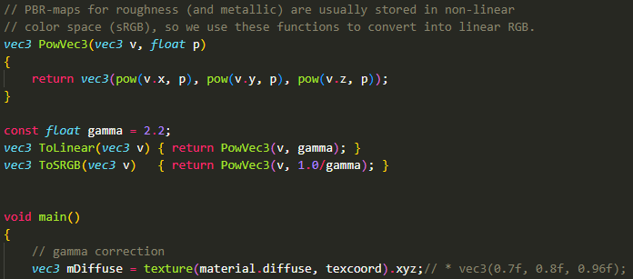

# Shader validator

[](https://www.rust-lang.org/)
[](https://github.com/antaalt/shader-validator/issues)
[](https://github.com/antaalt/shader-sense/issues)
[](https://marketplace.visualstudio.com/items?itemName=antaalt.shader-validator)
[](https://open-vsx.org/extension/antaalt/shader-validator)

This is a vscode extension allowing syntax highlighting, linting & symbol providing for HLSL / GLSL / WGSL shaders. It is using [shader-language-server](https://github.com/antaalt/shader-sense/tree/main/shader-language-server), a shader language server written in Rust to lint shaders using common validator API & parse symbols for some code inspection.

It is mostly intended to be used with big shader codebase used in production by providing interesting features such as region selection and a shader variant entry point selection for quickly switching between two entry point context with decent performances. This make it also quite reliable for small shader codebase.

Currently, it support some features and languages:

-   **[Syntax Highlighting](#syntax-highlighting)**: Improved syntax highlighting for code.
-   **[Diagnostic](#diagnostics)**: Highlight errors & warning as user type code.
-   **[Goto](#goto)**: Go to a symbol definition.
-   **[Completion](#autocompletion)**: Suggest completion items.
-   **[Hover](#hover)**: Add tooltip when hovering symbols.
-   **[Signature](#signature)**: Provide signatures when completing a function.
-   **[Formatting](#formatting)**: Format shader code.
-   **[Inlay hints](#inlay-hints)**: Add hints to function calls.
-   **[Variant](#variants)**: Define multiple shader variant entry point & quickly switch between them. 
-   **[Regions](#regions)**: Detect inactive regions in code due to preprocessor and grey them out.

|Language|Syntax Highlighting|Diagnostics |User symbols |Built-in symbols|Regions|Format|
|--------|-------------------|------------|-------------|----------------|-------|------|
|GLSL    |✅                 |✅(glslang)|✅           |✅             |✅     |✅   |
|HLSL    |✅                 |✅(DXC)    |✅           |✅             |✅     |✅   |
|WGSL    |✅                 |✅(Naga)   |❌           |❌             |❌     |❌   |

## Features

### Syntax highlighting

This extension provide improved syntax highlighting for HLSL, GLSL & WGSL than the base one in VS code.



### Diagnostics

You cant lint your code in real time through this extension:

-   GLSL relies on Glslang.
-   HLSL relies on DirectX shader compiler on desktop, Glslang on the web (see below).
-   WGSL relies on Naga.


### Autocompletion

The extension will suggest you symbols from your file and intrinsics as you type.


### Signature

View available signatures for your function as you type it.


### Hover

View informations relative to a symbol by hovering it.


### Goto

Go to your declaration definition by clicking on it.


### Formatting

Format your code using clang-format, configurable with .clang-format. clang-format need to be available in path.

### Inlay hints

Add inlay hints to your function calls. 


> You can disable this in settings.json (default pressed is Ctrl+Alt)
> ```json 
> "editor.inlayHints.enabled": "on"
> "editor.inlayHints.enabled": "onUnlessPressed"
> "editor.inlayHints.enabled": "off"
> "editor.inlayHints.enabled": "offUnlessPressed"
> ```

### Variants

Swap shader variant on the fly to change entry point & macro definition. This allow you to define and easily change between the one you have set, affecting regions. For example when you have a lot of entry point in a single shader file, splitted using macros, or want to see the content from your dependencies with the context passed from you main entry point.

You can then access these variants directly from the dedicated window and then access them by clicking on them.

A neat feature for big shader codebase with lot of entry point everywhere !

You can add one with the dedicated window or using the command `shader-validator.addCurrentFileVariant`. It will also help dxc and glslang validating your file in a huge codebase where DXC take a lot of time to validate using the lib profile.


### Regions

Grey out inactive regions depending on currently declared preprocessor & filter symbols.


### And much more

This extension also support some features such as document symbols, workspace symbols...

## Extension Settings

This extension contributes the following settings:

*   `shader-validator.validate`: Enable/disable validation with common API.
*   `shader-validator.symbols`: Enable/disable symbol inspection & providers.
*   `shader-validator.symbolDiagnostics`: Enable/disable symbol provider debug diagnostics.
*   `shader-validator.severity`: Select minimal log severity for linting.
*   `shader-validator.includes`: All custom includes for linting.
*   `shader-validator.pathRemapping`: All virtual paths.
*   `shader-validator.defines`: All custom macros and their values for linting.
*   `shader-validator.serverPath`: Use a custom server instead of the bundled one.

### HLSL specific settings: 

*   `shader-validator.hlsl.shaderModel`: Specify the shader model to target for HLSL
*   `shader-validator.hlsl.version`: Specify the HLSL version
*   `shader-validator.hlsl.enable16bitTypes`: Enable 16 bit types support with HLSL
*   `shader-validator.hlsl.spirv`: Enable SPIRV Vulkan syntax support for HLSL

### GLSL specific settings:

*   `shader-validator.glsl.targetClient`: Specify the OpenGL or Vulkan version for GLSL
*   `shader-validator.glsl.spirvVersion`: Specify the SPIRV version to target for GLSL


## Commands

*   `shader-validator.startServer`: Start the server if it was stopped or crashed.
*   `shader-validator.stopServer`: Stop the server.
*   `shader-validator.restartServer`: Restart the server if you have any issue.
*   `shader-validator.addCurrentFileVariant`: Add a variant to the current file.
*   `shader-validator.showLogs`: Open the extension log window.
*   `shader-validator.dumpDependency`: Print dependency tree in logs. mostly for debug.
*   `shader-validator.dumpAst`: Print internal ast in logs. mostly for debug.

## Platform support

This extension is supported on every platform, but some limitations are to be expected on some:
-   Windows x86_64: full feature set.
-   Linux x86_64: full feature set.
-   Mac & ARM Linux / Windows: Rely on WASI version of server, same as web, see web support for limitations.

## Web support

This extension run on the web on [vscode.dev](https://vscode.dev/). It is relying on the [WebAssembly Execution engine](https://marketplace.visualstudio.com/items?itemName=ms-vscode.wasm-wasi-core). Because of this restriction, we can't use dxc on the web as it does not compile to WASI and instead rely on glslang, which is more limited in linting (Only support some basic features of SM 6.0, while DXC support all newly added SM (current 6.8)).


## Questions and answers

### My shader entry point is hidden behind an inactive region and does not display symbols.

You can use shader variant to declare the entry point and the necessary macro without having to pass through global defines which might impact global state. It will also speed up validation by setting a stage and entry point.

### Request are really slow on big HLSL files

You can use shader variant and specify an entry point to speed up things. By default the extension is using the dxc lib profile which is quite a heavy process with big files with a lot of includes. By setting an entry point along a stage, it will speed up validation, but dxc might still have a hard time. Letting the server know where your code start can help it cache everything to the right place !

### How to check the logs ?

If you encounter an issue with the extension, you might want to check the log to see what is happening. You can simply go to the output tab of the terminal and use the scrolling menu to select Shader Language Server. Make sure you have set setting `shader-validator.trace.server` to verbose or messages at least.

## Credits

This extension is based on a heavily modified version of PolyMeilex [vscode-wgsl](https://github.com/PolyMeilex/vscode-wgsl)